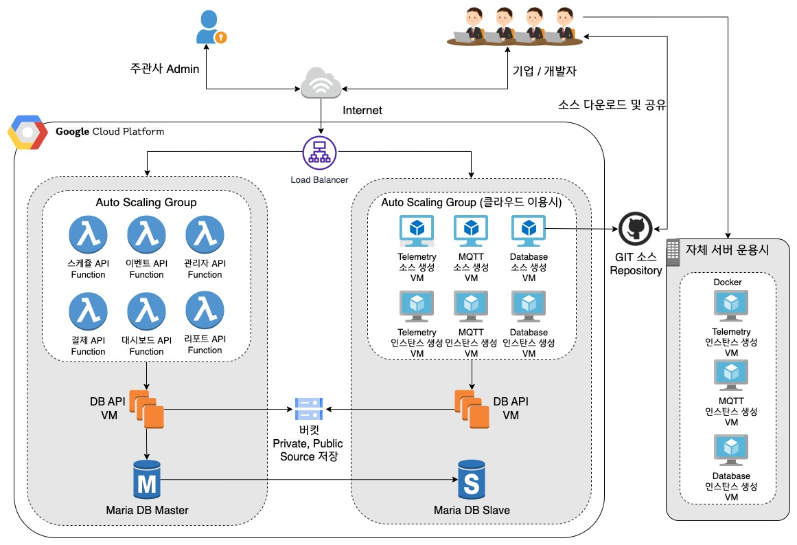
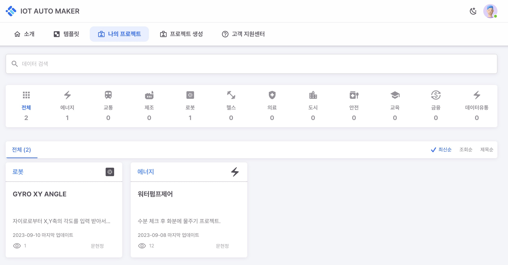
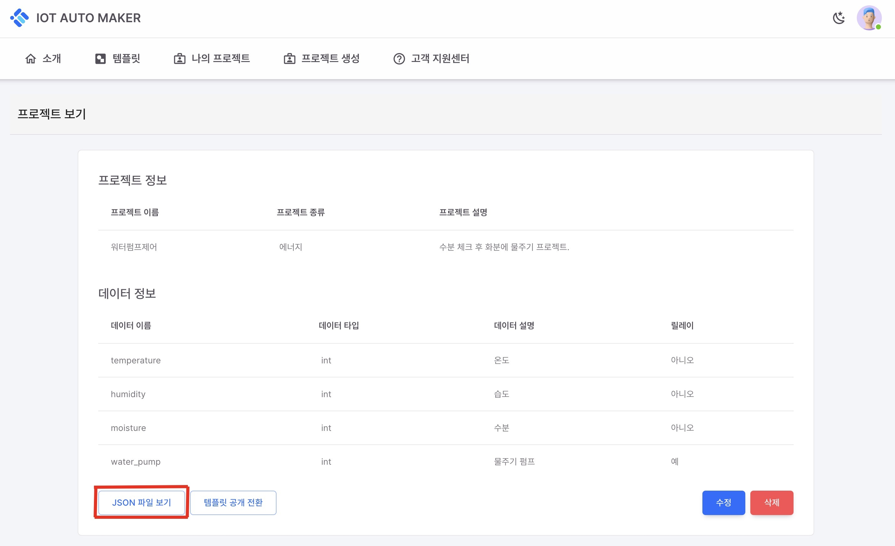

# IOT AUTO MAKER 

### 목표
- IoT 소스 자동 생성용 백엔드 서버 구축
### 폴더 구조
- [backend](backend/README.md) : FastAPI를 사용한 데이테베이스 API
- [documents](documents/README.md) : 문서 기능 정의 
- documents/images : 문서에 삽입되는 이미지 폴더

```
.
├── README.md : 현재 파일
├── backend : 백엔드 개발 폴더
│   ├── README.md
│   ├── app
│   │   ├── __init__.py
│   │   ├── database.py
│   │   ├── models.py
│   │   ├── routes
│   │   │   └── __init__.py
│   │   └── services
│   │       └── __init__.py
│   ├── main.py
│   └── requirements.txt
└── documents
    ├── README.md : 기능 정의 테이블
    ├── images : 문서 삽입용 이미지 파일들
    ├── 관리자_기능_문서.md
    └── 사용자_기능_문서.md

```
### 시스템 구조도


### 실행

- 나의 프로젝트에서 생성을 원하는 프로젝트 선택
  


- 프로젝트 보기에서 선택한 프로젝트의 json 파일 보기를 통해 json 파일 복사



```
- python -m venv .venv // 가상환경 생성
- source .venv/bin/activate // 가상환경 적용
- pip install -r requirements.txt
- python main.py "복사한 json파일의 위치 혹은 json 파일의 링크"
```
- /backend/build에 폴더 생성
